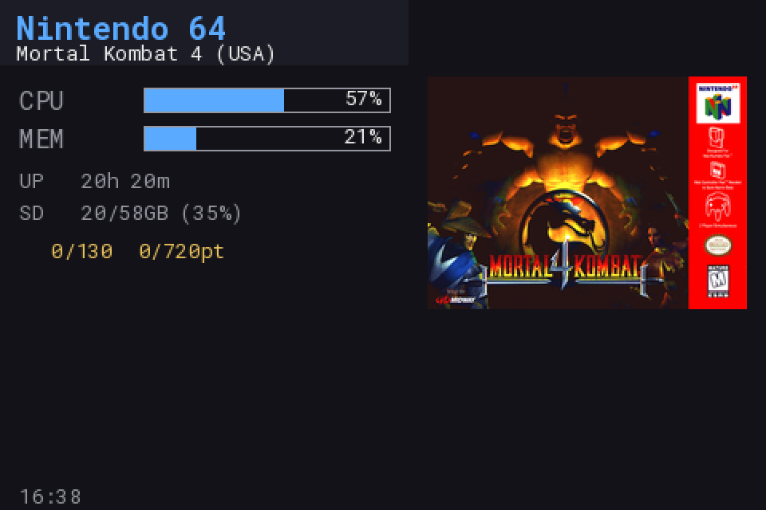
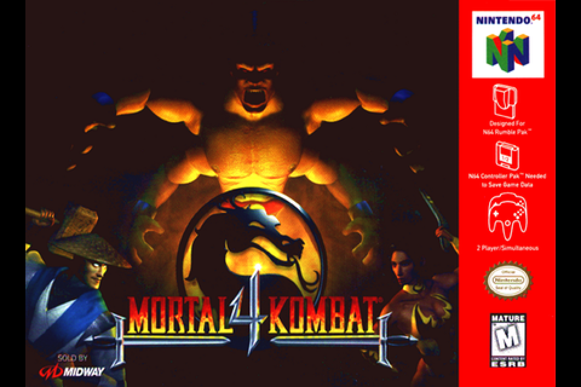
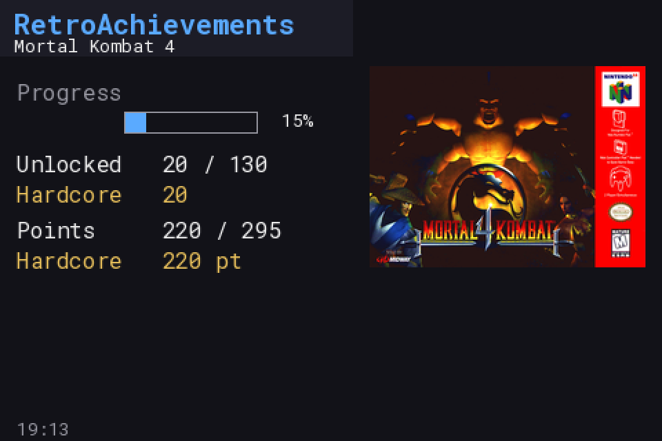
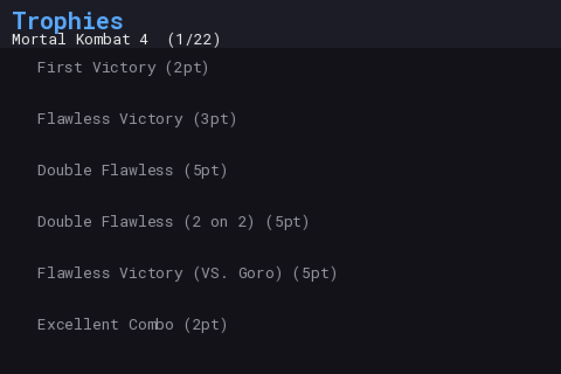
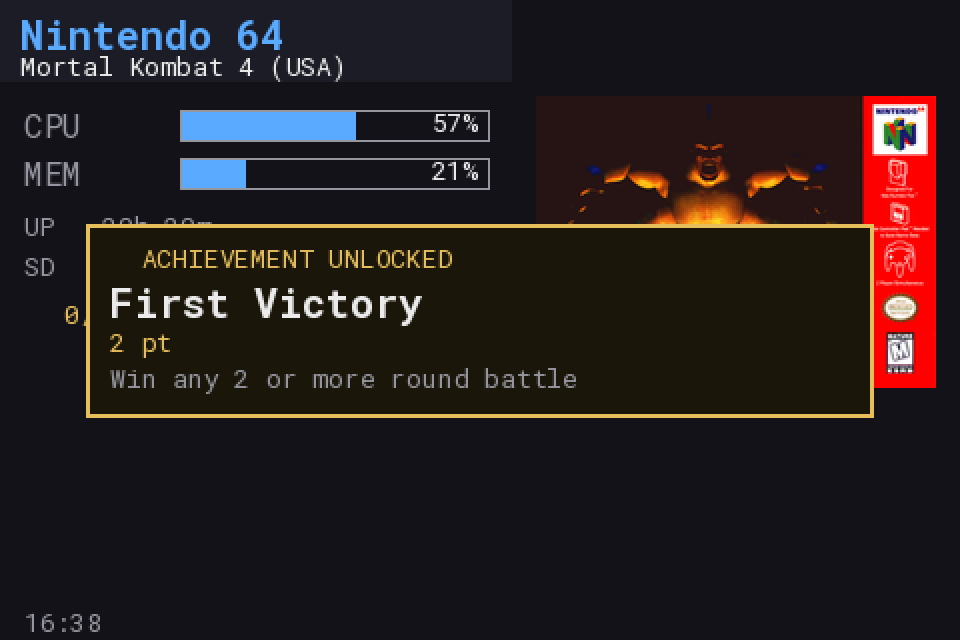

# mister_turing_client

A status HUD for MiSTer FPGA that runs on a Turing/XuanFang/UsbMonitor-style
USB smart screen, talking directly to `mister_status_server.py` — the same
JSON API the [MiSTer_monitor](https://github.com/chipster6502/MiSTer_monitor)
ESP32 firmware uses, just from a plain Python client instead of on-panel
firmware. See [`docs/technical-notes.md`](docs/technical-notes.md) for why.

## Contents

- [Quickstart](#quickstart)
- [Screenshots](#screenshots)
- [Features](#features)
- [Page rotation modes](#page-rotation-modes)
- [Artwork setup](#artwork-setup)
- [Building the runtime bundle](#building-the-runtime-bundle)
- [Layout](#layout)
- [Usage](#usage)
- [Roadmap](#roadmap)
- [License](#license)

## Quickstart

**Requirements**

- A MiSTer with network access, running
  [MiSTer_monitor](https://github.com/chipster6502/MiSTer_monitor)'s
  `mister_status_server.py` already installed and running - see that
  project's own instructions. This client is a display for its API, not
  a replacement for it; with nothing answering on port 8081 there's
  nothing to show.
- A Turing/XuanFang/UsbMonitor-family USB smart screen, plugged into the
  MiSTer.
- SSH access to the MiSTer (`root`, default password `1` unless you've
  changed it).

**Steps**

1. Copy this repo onto the MiSTer - `scp`, WinSCP, or MiSTer's own Samba
   share all work equally well:
   ```
   scp -r mister_turing_client root@<mister-ip>:/media/fat/mister_turing_client_install
   ```
2. SSH in and build the runtime bundle - once, needs network access (see
   [Building the runtime bundle](#building-the-runtime-bundle)):
   ```
   ssh root@<mister-ip>
   cd /media/fat/mister_turing_client_install
   bash build_pylibs.sh
   ```
3. Install - wires up autostart + crash-respawn and starts the client
   immediately:
   ```
   bash install.sh
   ```

That's it - the screen should already be showing "Now Playing" (or
"Waiting for MiSTer status server..." if the requirements above aren't
reachable yet). It survives reboots and restarts itself if the USB
connection ever drops.

Artwork and RetroAchievements are both optional, off by default, and
covered under [Artwork setup](#artwork-setup) and [Features](#features) -
nothing above requires either.

Everything lives at `/media/fat/Scripts/.config/mister_turing_client/`
(its own directory, not nested inside mister_monitor's, even though it
talks to `mister_status_server.py` at runtime):

```
bash /media/fat/Scripts/.config/mister_turing_client/start_turing_client.sh {start|stop|restart|status}
bash /media/fat/Scripts/.config/mister_turing_client/uninstall.sh   # asks before deleting config.ini/artwork_cache/
```

## Screenshots

Software-rendered, not phone photos of the physical screen yet - real
render code against real data pulled live off a running MiSTer, at native
480x320, pixel-doubled for legibility here. Swap-in-ready for real
hardware photos later; the layout and content are exactly what's on the
actual screen.

| | |
|---|---|
| **Now Playing** — core/game identity, stats, artwork | **Box Art** — full-screen |
|  |  |
| **RA Progress** | **RA Trophies** |
|  |  |

**Achievement unlock popup** (overlays whatever page is showing):



## Features

- **Now Playing** — core/game identity, CPU/memory bars, uptime, SD
  usage, and game/core artwork fetched on demand.
- **Box Art** — the same artwork full-screen. An idle screensaver -
  cycling through everything already fetched this session - when nothing
  is loaded, instead of a blank screen.
- **RA Progress** / **RA Trophies** — progress, points/hardcore
  breakdown, a paginated trophy list, and the same artwork sidebar Now
  Playing shows. Shown only while the *active core* is actually
  RA-adapted, not just because the loaded ROM's hash happens to match
  something in RA's database - see `is_ra_core_active()`.
- **Achievement unlock popup** overlays whatever page is showing the
  moment the server reports one.
- **Configurable page rotation**, including a different one specifically
  while playing an RA-adapted core - see [below](#page-rotation-modes).

<details>
<summary><b>More detail</b></summary>

- **Arcade artwork** is handled specially: MiSTer's Arcade core reports a
  different `core_raw` per loaded `.mra` (its own MAME-style setname, e.g.
  `rtype`, `tmnt2`) rather than a stable "this is arcade" identifier, so
  artwork lookups key off the snapshot's own `is_arcade` flag instead. An
  RA-adapted core (odelot fork, launched directly rather than via MiSTer
  Companion) reports `core_raw` with its `RA_` prefix intact too -
  stripped the same way for artwork lookups.
- **Debounced identity changes** — a new game/core only gets acted on
  once it's been seen on two consecutive polls, not the first time it
  appears. Confirmed needed in practice: OSD ROM browsing can briefly,
  confidently report a highlighted-but-never-loaded game as the active
  one.
- **Backgrounded artwork fetch + decode** — never blocks the poll/render
  loop. Measured on real hardware: fetch + decode can cost over a second
  of real CPU time, landing exactly at game-load time - the same moment
  a just-loaded core is already doing its own heaviest work.
- **Previous art stays up during a fetch** rather than flashing "No
  artwork" first - it's replaced once the new fetch actually resolves,
  success or not.
- **Split, region-based redraws** — the artwork panel (by far the
  largest payload over this display's slow serial link) only gets
  re-pushed when the game/system identity actually changes, not on every
  poll tick just because a stat number ticked over.
- **RA Progress's `unlocks_tracked` field** answers "is an RA-adapted
  core running right now", not "is the fork installed" - see
  [`docs/technical-notes.md`](docs/technical-notes.md#retroachievements-reading-unlocks_tracked-correctly)
  for the nuance and how to enable live (<1s) unlock detection.

</details>

## Page rotation modes

`--pages` (or `config.ini`'s `[pages]`) takes a comma-separated list and
rotates through exactly those, in that order - so a single name pins the
display to just it, no rotation at all:

```
--pages boxart                    # box art only, full-screen
--pages now_playing                # stats + artwork only, no RA pages ever
--pages ra_summary,ra_trophies     # RA-only, skips Now Playing/Box Art
```

`config.ini`'s `[pages_ra]` goes one further: a *second*, independent
rotation that automatically takes over for as long as an RA-adapted core
is active, switching back the instant it isn't - e.g. cover art only
normally, but the full experience the moment you're playing something
RA-tracked:

```ini
[pages]
pages=boxart
page_seconds=15

[pages_ra]
pages=now_playing,boxart,ra_summary,ra_trophies
```

`--pages`/`--page-seconds` on the command line override both sections
unconditionally when given, for one-off testing. See `config.ini.example`
for the full set of comments on precedence and defaults.

## Artwork setup

Copy `config.ini.example` to `config.ini` (gitignored - never commit real
credentials). Two independent sources, either one alone, both, or neither
is a valid setup:

- **`[screenscraper]`** — `ss_user`/`ss_pass` (free member account) plus
  `ss_dev_user`/`ss_dev_pass` (a separate *developer* key, manually
  requested and approved on ScreenScraper's forum). The primary source
  when configured; richer media (wheel art, marquees, system art), but
  that developer key is a real bottleneck to get approved.
- **`[libretro]`** — `base_url` pointing at a self-hosted
  [`libretro-artwork-api`](https://github.com/kadafi916/libretro-artwork-api)
  instance. No credentials, no rate limit, no forum - the fallback
  whenever ScreenScraper is unconfigured or has no match, at the cost of
  game-only art (no system/wheel art) and only for systems actually
  cloned into that service's data directory.

See [`docs/technical-notes.md`](docs/technical-notes.md#alternatives-considered-for-artwork)
for why these two and not something else. Downloaded art is cached under
`artwork_cache/` (gitignored), keyed by CRC or system id, so nothing is
re-fetched once seen.

## Building the runtime bundle

MiSTer's own Python has no pip-installable Pillow or numpy, and no
compiler on-device to build them - `build_pylibs.sh` assembles both
(plus pyserial) from prebuilt ARM wheels and extracted Debian `.deb`
libraries, no manual steps:

```
bash build_pylibs.sh
```

Run once on the MiSTer itself (needs network access), before
`install.sh`. See [`docs/technical-notes.md`](docs/technical-notes.md#why-the-odd-pylibsvendor_libs-layout)
for exactly what it fetches, why, and how to verify a newer version
before trusting it.

## Layout

```
mister_turing_client.py   entry point - poll + render + push, in a loop
screenscraper.py           ScreenScraper artwork client
screenscraper_systems.py   MiSTer core name -> ScreenScraper systemeid table
libretro_thumbs.py         libretro-artwork-api fallback client
retroachievements.py       thin client over mister_status_server.py's RA endpoints
config.py                  config.ini loader
turing_lcd/                trimmed vendored slice of turing-smart-screen-python's
                            library/lcd (LcdCommRevA + base class), GPL-3.0-or-later
fonts/                      RobotoMono (Apache-2.0, from turing-smart-screen-python's res/)
pylibs/                     vendored Pillow, numpy, pyserial (see above)
vendor_libs/                extra .so files Pillow/numpy need beyond MiSTer's own
mister/                     start_turing_client.sh (installed on-device by install.sh)
build_pylibs.sh             assembles pylibs/ + vendor_libs/ - see above
install.sh / uninstall.sh   on-device install/autostart
```

## Usage

```
python3 mister_turing_client.py [--server http://127.0.0.1:8081] [--port AUTO]
                                 [--interval 2.0] [--brightness 80]
                                 [--pages ...] [--page-seconds ...] [--once]
```

Defaults assume `mister_status_server.py` is running on the same MiSTer
(`127.0.0.1:8081`) and the screen is auto-detected by VID/PID/serial
(`USB35INCHIPSV2`, WCH `1a86:5722`). No wrapper script is required —
`LD_LIBRARY_PATH`/`PYTHONPATH` are set by the script re-executing itself.
With no `mister_status_server` reachable, it shows a "Waiting for MiSTer
status server..." screen and keeps polling rather than crashing.

Run into something confusing - a credential problem that looks like a
different kind of failure, RA/artwork silently producing nothing for one
specific game? See [TROUBLESHOOTING.md](TROUBLESHOOTING.md).

## Roadmap

Touch-equivalent navigation doesn't exist on this hardware (output-only
screen), so further pages would still need to be timer-cycled. Not yet
built: the extension-based system disambiguation ScreenScraper's firmware
integration has (e.g. a 2600 cartridge loaded on the 7800 core) - those
cores fall back to their own system, correct in the large majority of
cases.

## License

GPL-3.0-or-later. `turing_lcd/` is a trimmed, vendored slice of
[`turing-smart-screen-python`](https://github.com/mathoudebine/turing-smart-screen-python)
(same license); `fonts/` is RobotoMono (Apache-2.0, from that project's
`res/`). See [LICENSE](LICENSE).
